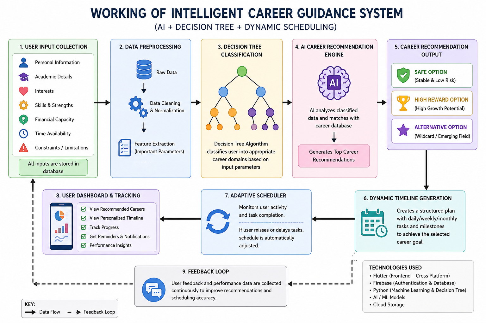
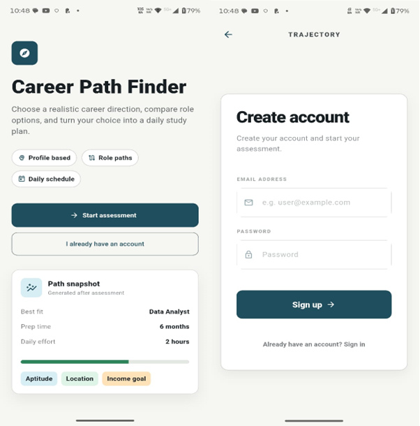
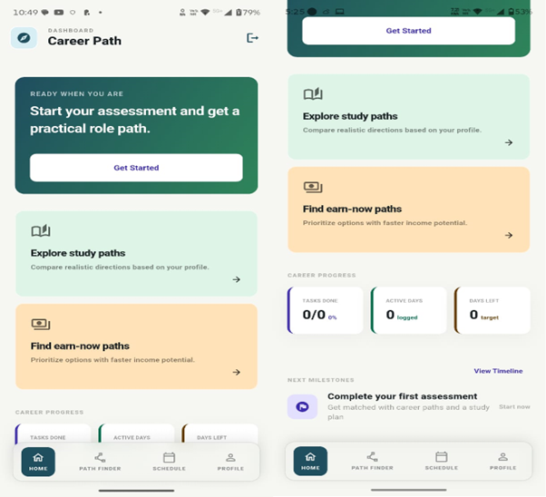
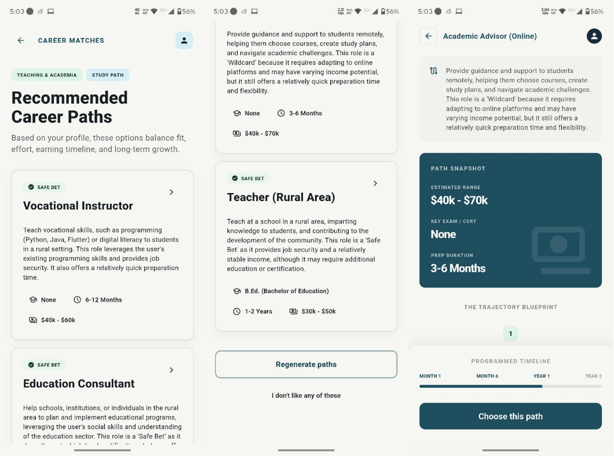
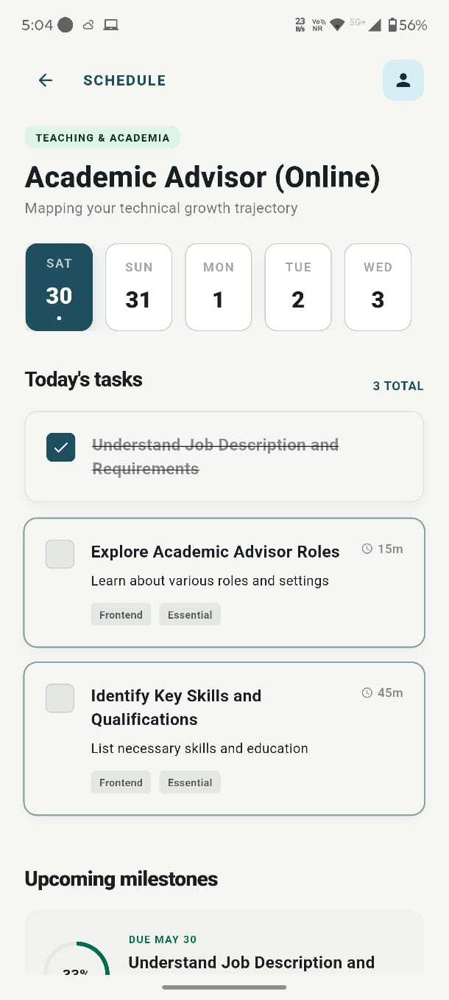

# 🚀 NextStepAI

### Intelligent Career Guidance and Adaptive Planning System

---

## 📌 Overview

NextStepAI is an AI-powered career guidance system designed to help students and learners make informed, personalized, and practical career decisions. Unlike traditional systems that provide only suggestions, NextStepAI bridges the gap between **career selection and execution** by generating structured and adaptive career roadmaps.

---

## 🎯 Problem Statement

Choosing a career is complex due to:

* Lack of personalized guidance
* Limited awareness of emerging career options
* Ignoring real-world constraints (budget, time, location)
* No clear execution plan after selecting a career

---

## 💡 Solution

NextStepAI provides:

* 🎯 Personalized career recommendations
* 📊 Multi-parameter analysis (skills, interests, constraints)
* 🧠 AI + Decision Tree based decision making
* 🛣️ Structured timeline for goal achievement
* 🔄 Adaptive scheduling based on user performance

---

## ⚙️ How It Works

```text
User Input → Decision Tree Classification → AI Recommendation Engine → Career Paths → Timeline Generation → Adaptive Scheduling
```

---

## 🧠 Key Features

* ✅ Personalized career suggestions
* ✅ Safe, High-Reward, and Wildcard career paths
* ✅ Real-world constraint integration
* ✅ Dynamic and adaptive scheduling
* ✅ Persistent user data and recommendations
* ✅ Execution-focused career planning

---

## 🏗️ System Architecture



---

## 📸 Screenshots






---

## 🎥 Demo Video

👉 [Watch Demo Video](#)
*(https://drive.google.com/file/d/1f0N9OHSOORqM1F1qjJXMUlU_ZT4945Nl/view?usp=sharing)*

---

## 🧪 Tech Stack

* **Frontend:** Flutter
* **Language:** Dart
* **Backend:** Firebase
* **AI Model:** LLaMA 3.1 (via API)
* **State Management:** Riverpod
* **API Integration:** HTTP

---

## 📂 Project Structure

```text
NextStepAI/
│
├── README.md
├── docs/
│   ├── project_report.pdf
│   ├── architecture.png
│
├── screenshots/
├── demo/
│   └── demo_video.mp4
│
├── lib/
├── assets/
├── pubspec.yaml
└── .gitignore
```

---

## ⚡ Installation & Setup

```bash
git clone https://github.com/Priyvratmodi/NextStep-AI.git
cd NextStepAI
flutter pub get
flutter run
```

---

## 🔍 Unique Selling Points (USP)

* 🔹 Combines **Decision Tree + AI** for accurate recommendations
* 🔹 Incorporates **real-world constraints** (budget, time, location)
* 🔹 Provides **execution roadmap**, not just suggestions
* 🔹 Features **adaptive scheduling** based on user behavior
* 🔹 Ensures **consistent recommendations** using persistent data

---

## 📊 Use Cases

* Students confused about career options
* Learners seeking structured preparation plans
* Individuals exploring alternative or emerging careers

---

## 🚀 Future Scope

* Real-time job and exam notifications
* AI-based behavioral and productivity analysis
* Career simulation (“day-in-the-life” experience)
* Distraction control and focus enhancement features

---

## 📄 Project Report

👉 [View Full Report](docs/project_report.pdf)

---

## 👨‍💻 Author

**Priyvrat Modi**
Bachelor of Computer Application (BCA)
Amity University Online

---

## 📜 License

This project is for academic and research purposes.

---
